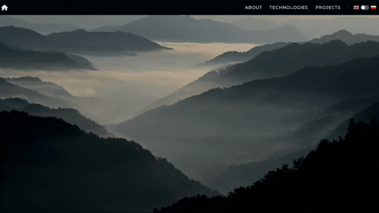

# Portfolio Website

## Preview

**[www.portfolio.lukaszsliwinski.pl](http://www.portfolio.lukaszsliwinski.pl)**

## About the Project

This website showcases my work as a front-end developer, including some of my side projects. It provides information about my skills and the technologies I use.

## Technologies Used

### Frontend
- TypeScript
- React
- Tailwind CSS
- Flowbite

### Backend
- JavaScript
- Node.js
- Express.js

## Features

- Responsive design
- Interactive UI components
- Multi-language support
- Project showcase with detailed descriptions
- Contact form
